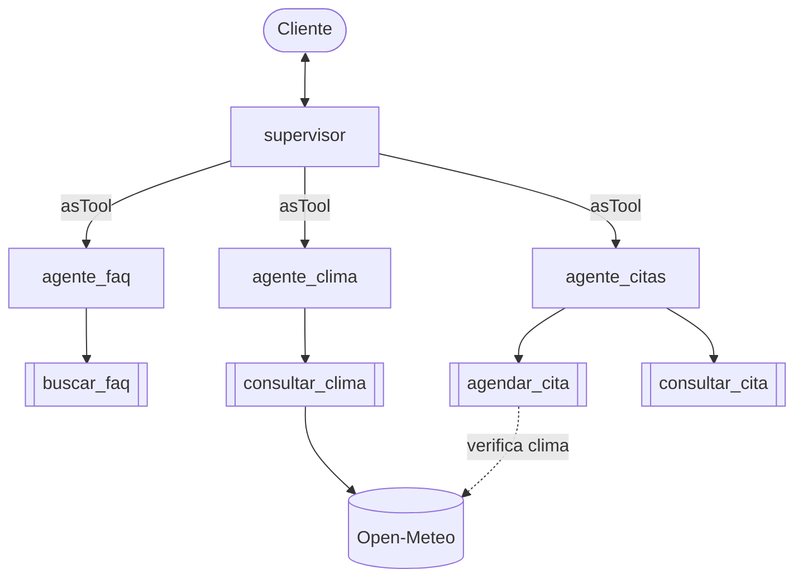

# Arquitectura centralizada

Un supervisor único recibe todos los mensajes y usa a cada especialista como herramienta (`asTool`). Los especialistas no se comunican entre sí; el supervisor decide el orden (clima antes de cita) y redacta la respuesta final.

Programa: [`arquitecturas/centralizada.js`](../arquitecturas/centralizada.js)
