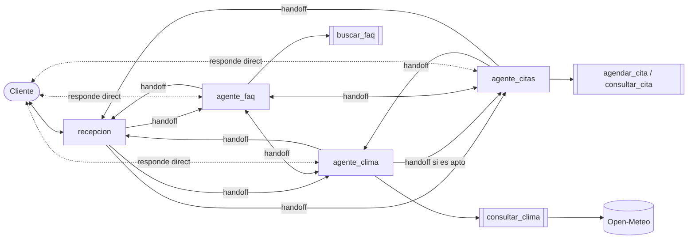

# Arquitectura descentralizada

No existe un supervisor. Los agentes son pares y se transfieren la conversación con `handoffs`; el agente que recibe el control responde directamente al cliente y conserva la conversación en el siguiente turno. La recepción solo clasifica la solicitud inicial.

Programa: [`arquitecturas/descentralizada.js`](../arquitecturas/descentralizada.js)
