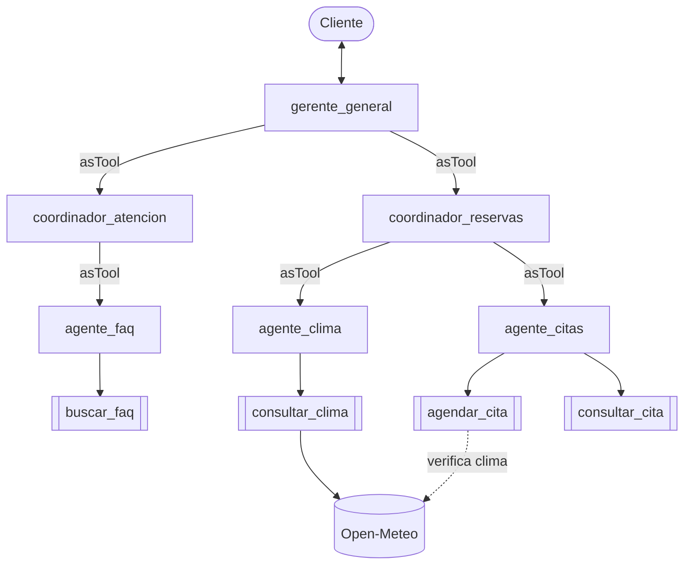

# Arquitectura jerárquica

Tres niveles: el gerente general delega en coordinadores de área y cada coordinador delega en sus especialistas. Cada nivel usa al inferior como herramienta (`asTool`). El coordinador de reservas aplica la regla de negocio: consultar el clima antes de agendar.

Programa: [`arquitecturas/jerarquica.js`](../arquitecturas/jerarquica.js)
